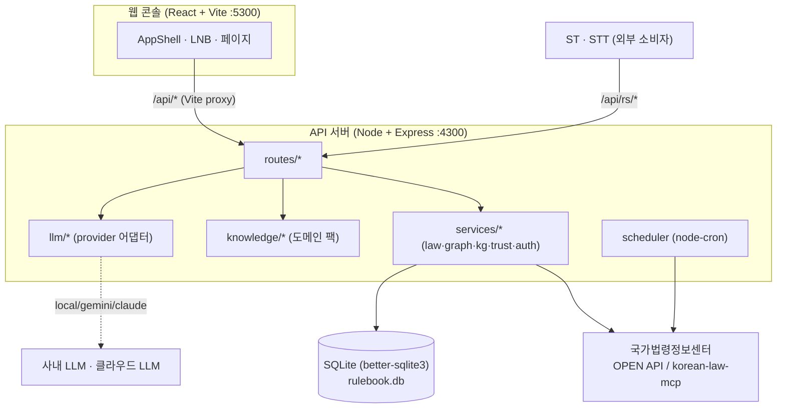
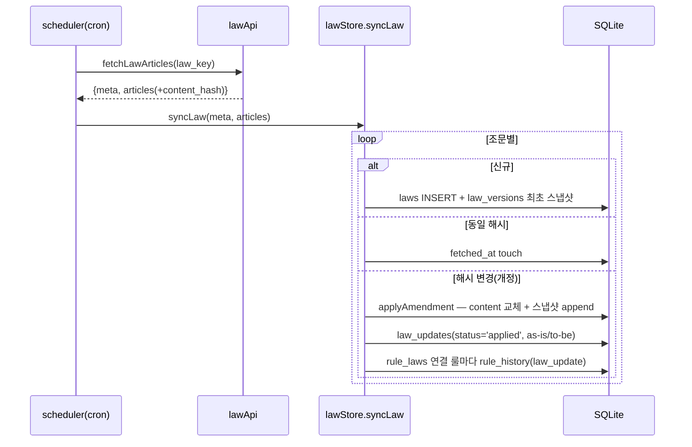

# Rulebook Admin 설계서

> **WiseAegis Rulebook — 규정관리(03) 콘솔**
> 회사 내규 파일을 업로드하면 도메인을 자동 감지하고, 관련 법령을 붙여, 편집 가능한 룰셋을 자동 생성하는 온프레미스 지향 규정관리 관리자 콘솔.
>
> 문서 버전: 1.0 · 최종 갱신: 2026-07-24 · 대상 코드베이스: `rulebook-admin@0.1.0`

---

## 1. 개요

### 1.1 목적
금융·증권·자동차 등 판매 도메인의 **내규(사규·약관·매뉴얼)** 를 입력받아, AI(또는 규칙기반 엔진)로 **준수 규칙(룰)** 을 추출하고, 각 룰에 **근거 법령**을 연결하여, 검토·승인·게시 과정을 거친 뒤 **ST/STT(상담 판정 엔진)가 소비하는 룰셋(RuleSet) API**로 노출하는 것이 목적이다.

### 1.2 핵심 가치
| 가치 | 구현 |
|---|---|
| **온프레미스 정합** | 기본 엔진이 오프라인 규칙기반(`ruleBased`) — 폐쇄망에서 키 없이 즉시 동작. LLM 실패 시 자동 폴백 |
| **근거 추적성** | 룰 → 내규 청크 → 개념 → 법령 조문까지 provenance 그래프로 역추적 (요구사항 B) |
| **법령 최신성** | 국가법령정보센터 OPEN API에서 조문을 수집하고, 스케줄러가 개정을 감지해 **즉시 반영**하며 as-is/to-be 이력 보존 |
| **표준 정합** | 룰셋마다 표준태그사전을 복제·편집하는 의미태그/행위태그 체계 |

### 1.3 사용자 흐름 (End-to-End)
```
내규 업로드/붙여넣기
   → 파싱(xlsx·pdf·csv·txt) → 도메인 자동 감지
   → 룰 추출(LLM 또는 규칙기반) + 판단근거·행위태그 생성
   → 인용 법령 자동 수집 → 룰↔조문 연결
   → [담당자] 룰 검토·편집·승인
   → 게시(publish) → RSET/RULE 식별자 발급
   → ST·STT가 RS API(listRuleSets/loadRuleSet)로 소비
```

---

## 2. 시스템 아키텍처

### 2.1 구성도


### 2.2 프로세스/포트
| 구성요소 | 포트 | 실행 | 비고 |
|---|---|---|---|
| Web (Vite dev) | **5300** | `npm --prefix web run dev` | `^/api/` 요청을 `:4300`으로 프록시 |
| API (Express) | **4300** | `npm --prefix server run dev` (`node --watch`) | |
| 동시 실행 | — | 루트 `npm run dev` (concurrently) | server + web |

> Vite 프록시 키는 `^/api/`로 좁혀져 있다. `/api`(RS API 탐색기 SPA 라우트)가 백엔드로 새어나가 `Cannot GET /api`가 뜨는 문제를 막기 위함이다. — [vite.config.js:11](../web/vite.config.js#L11)

### 2.3 기술 스택
| 계층 | 기술 |
|---|---|
| 프론트 | React 18 · React Router 6 · Vite 5 (상태관리 라이브러리 없음 — Context + 폴링) |
| 백엔드 | Node (ESM) · Express 4 |
| DB | SQLite (better-sqlite3, 동기 API, WAL 모드) |
| 파싱 | SheetJS `xlsx` · `pdfjs-dist`(한국어 CID CMap 포함) · 자체 CSV 파서 |
| LLM | provider 어댑터: `ruleBased`(기본) / `local` / `gemini` / `claude` / `openai` / `grok` / `mistral` |
| 법령 | `korean-law-mcp`(검색) + `law.go.kr/DRF` 직접 호출(수집·diff) |
| 스케줄 | `node-cron` |
| 인증 | scrypt 해시 + 서버측 세션 토큰(불투명, 비-JWT) |

---

## 3. 데이터 모델

DB는 `server/data/rulebook.db` (WAL). 스키마는 [server/src/db.js](../server/src/db.js)에서 부팅 시 `CREATE TABLE IF NOT EXISTS`로 보장하고, 후행 컬럼은 `addColumn()` 헬퍼로 멱등 `ALTER` 처리한다.

### 3.1 저작(Authoring) 코어
| 테이블 | 역할 | 핵심 컬럼 |
|---|---|---|
| `documents` | 업로드된 내규 원문 | `content`, `format`, `hint`(담당자 보충설명) |
| `rulesets` | 룰셋(도메인 단위) | `status`(draft\|published), `ruleset_id`(RSET…), `panel_id`(JPNL…), `version`(semver), `aggregate_method`, `block_threshold`, `product_id/name` |
| `rules` | 개별 룰 | `tag`(의미태그), `action_tags`(JSON), `title`, `severity`, `speaker`, `internal_source`(📄내규 출처), `law_basis`(⚖법령 근거), `knowledge`(판단근거), `law_compare`(대조노트), `chunk_id`, `status`(draft\|approved), `rule_uid`(RULE…) |

### 3.2 법령 파이프라인
| 테이블 | 역할 |
|---|---|
| `laws` | 조문 단위 저장. `UNIQUE(law_key, article_no)`, `content_hash`(개정 감지 키), `status`(active\|superseded) |
| `law_versions` | 조문 스냅샷(append-only). 과거 시점 조문 복원 (요구사항 5) |
| `law_updates` | 개정 큐/이력. `old_content`/`new_content`(as-is/to-be), `affected_rules`, `status`(pending\|applied\|approved\|rejected) |
| `law_check_runs` | 법령 점검 실행 기록(재시작 후에도 '마지막 업데이트' 유지) |
| `rule_laws` | 룰↔조문 N:M 연결. `UNIQUE(rule_id, law_id)`, `linked_by`(ai\|user) |

### 3.3 이력·근거·그래프
| 테이블 | 역할 |
|---|---|
| `rule_history` | 룰 변경 이력. `source`(user_edit\|ai_extract\|ai_proposal\|law_update), `law_update_id` |
| `doc_chunks` | 내규 문서를 줄 단위 청크로 분할 (근거 추적) |
| `kg_entities` / `kg_triples` / `kg_schema` | 지식그래프(AutoSchemaKG) — 엔티티·(주어-관계-목적어) 트리플·유도 스키마 |
| `kg_dismissed` | AI 스키마 제안 중 사용자가 '무시'한 개념 (재제안 방지) |
| `ruleset_tags` | 룰셋별 태그 사전(표준 복제 후 편집). `kind`(meaning\|action), `origin`(standard\|custom), `active` |
| `app_settings` | 런타임 key-value 설정 ([services/settings.js](../server/src/services/settings.js)) |

> **설계 원칙:** 지식그래프·트러스트·태그 층은 모두 **서빙 계약(RS-2)과 독립**이다. 서빙 룰셋은 그대로 두고, 이 층들은 "어디서 왔나 / 얼마나 믿을 만한가"만 설명한다.

---

## 4. 백엔드 설계

진입점 [server/src/index.js](../server/src/index.js): CORS 오픈, JSON 15MB. 부팅 시 `seedMaster()`(최초 마스터 계정) → `applyPendingAmendments()`(대기 개정 즉시 반영 마이그레이션) → `startScheduler()`.

### 4.1 라우트 & 접근 제어
| 마운트 | 가드 | 설명 |
|---|---|---|
| `GET /api/status` | 없음 | provider/model, 도메인 팩, 카운트, 스케줄러 정보 |
| `/api/auth` | 없음 | 로그인/로그아웃/me |
| `/api/rulesets` | `authRequired` + `writerOnly` | 룰셋·룰 CRUD, 추출, 게시 (핵심 모듈) |
| `/api/laws` | `authRequired` + `writerOnly` | 법령 검색·수집·개정 |
| `/api/settings` | `authRequired` + `writerOnly` | LLM·스케줄·경로 런타임 설정 |
| `/api/users` | `authRequired` + `masterOnly` | 사용자 관리 |
| `/api/rs` | **없음** | ST·STT 소비 엔드포인트(외부 시스템, 세션 인증 대상 아님) |

세 단계 접근 제어: **오픈**(auth·rs) / **writer 게이트**(rulesets·laws·settings) / **master 게이트**(users).

### 4.2 LLM Provider 어댑터
[llm/index.js](../server/src/llm/index.js) · [llm/providers.js](../server/src/llm/providers.js) · [llm/remote.js](../server/src/llm/remote.js) · [llm/ruleBased.js](../server/src/llm/ruleBased.js)

**Provider 결정 순서:** `app_settings.llm_provider` → `process.env.LLM_PROVIDER` → `'ruleBased'`. 설정 변경 시 **재시작 없이** 반영.

```
analyzeDocument(doc, productName, hint)
  ├─ provider === 'ruleBased' → ruleBasedAnalyze()   # 오프라인, 키 불필요
  └─ else → llmAnalyze(provider, ...)
             └─ 실패 시(폐쇄망·키 미설정 등) → ruleBased 폴백
                engine = "<provider> 실패 → ruleBased 폴백 (msg)"
```

**통일 계약:** 모든 엔진은 `{ domain, detection, rules[], log, unmatched, engine }`를 반환하고, 각 룰은 `{ tag, title, severity, speaker, source_rule_id, internal_source, law_basis, knowledge, action_tags }` 형태다.

- **도메인 감지는 항상 로컬·결정적**(`detectDomain`)으로 수행하고, LLM은 룰 내용 생성만 담당한다.
- 등록된 provider(providers.js): `local`(Ollama/vLLM), `gemini`, `claude`, `openai`, `grok`, `mistral`. `ruleBased`는 내부 폴백 전용이라 레지스트리에서 제외.
- remote.js는 provider별 `kind`(ollama/gemini/claude/openai-호환)에 따라 요청 바디·헤더를 구성하고, gemini는 구조화 출력 스키마(`GEMINI_SCHEMA`)로 JSON 깨짐을 방지하며, 잘림(finishReason≠STOP 등)을 예외로 처리한다.

### 4.3 지식(도메인 팩)
[knowledge/index.js](../server/src/knowledge/index.js) — 팩 레지스트리 + 도메인 감지 + 판단근거 조립.

- **`PACKS`**: `finance`(금융상품) · `securities`(증권/금융투자) · `auto`(자동차). 각 팩 = `{ kw(키워드→태그), klib(태그→지식), sample, prod, [detect] }`.
- **`detectDomain(doc)`**: 팩별 **고유 개념(태그) 일치 수**로 점수. `detect` 목록이 있으면(securities) 팩 고유어만으로 판별해 오탐을 줄인다.
- **`mapConcepts(domain, doc)`**: 내규 각 줄 → 태그 매핑(첫 등장 줄이 출처).
- **`buildKnowledge`**: `[정의][근거][준수][위반]` + 예시 조립, `{PRODUCT}` 치환.
- **`deriveActionTags`**: 도메인 무관 공통 사전(EXPLAIN/NOTIFY/PROVIDE/CONFIRM/…)으로 행위태그 유도(최대 4).
- **`cleanKnowledge`/`splitMeaningTags`**: 판단근거 본문에서 서빙 메타 라인(`[부류]`·`[체크리스트 항목]`·`[추가 의미태그]`)을 분리. `[추가 의미태그]` 라인은 별도 컬럼 없이 '의미태그 운반체'로 쓰여 서빙 시 `required_meaning_tags`로 옮겨진다.

도메인 팩별 규모: finance ≈37태그(13조 샘플), securities ≈32태그(21항목 자가점검, 최대 팩·`SEC_DETECT` 별도), auto ≈17태그(12조 샘플).

### 4.4 서비스 계층 (`services/*`)
| 서비스 | 책임 |
|---|---|
| [lawApi.js](../server/src/services/lawApi.js) | 국가법령정보센터 직접 호출. `searchLaws`, `fetchLawArticles`(조문 평문화 + `content_hash=sha256`) |
| [mcpLaw.js](../server/src/services/mcpLaw.js) | `korean-law-mcp` stdio 검색 엔진(약칭 인식·랭킹 우수). **검색만** MCP, **수집·diff는 lawApi**(해시 안정성) |
| [lawStore.js](../server/src/services/lawStore.js) | 조문 적재 + 개정 **즉시 반영**(`syncLaw`/`applyAmendment`). 승인 단계 없음 |
| [scheduler.js](../server/src/services/scheduler.js) | 주기 법령 재점검(cron). `runCheckNow`, 재예약, on/off |
| [lawLink.js](../server/src/services/lawLink.js) | 룰 `law_basis` 자유문자열 → 실제 조문 매칭 → `rule_laws` 등재 |
| [graph.js](../server/src/services/graph.js) | provenance 그래프(문서→청크→룰→개념/법령) |
| [history.js](../server/src/services/history.js) | 룰/룰셋 변경 이력 통합 로깅 |
| [parsers.js](../server/src/services/parsers.js) | 내규 파일 파싱(xlsx·csv·pdf 좌표 기반 줄 재구성) |
| [tagset.js](../server/src/services/tagset.js) | 룰셋별 태그 사전(표준 82 의미태그 복제 + custom) |
| [trust.js](../server/src/services/trust.js) | 근거 신뢰도 등급(strong/medium/weak) + 근거 경로 6단계 |
| [settings.js](../server/src/services/settings.js) | `app_settings` key-value(빈 값이면 .env로 복귀) |
| kg/[index·ruleBasedKG·taxonomy·proposals](../server/src/services/kg) | AutoSchemaKG 지식그래프 유도 + AI 스키마 제안 |

### 4.5 지식그래프 & AI 제안
- **KG 유도(`buildKG`)**: 결정적(오프라인) 규칙기반. 룰마다 3종 트리플 생성 — ① 의무(`주체 —[고지/설명/금지/확인]→ 개념`) ② 개념화(`주어 —[유형]→ 개념`) ③ 근거(`주어 —[근거]→ 법령조문`). `taxonomy.js`의 태그 접두어 맵으로 상위 개념 유도.
- **AI 제안(`buildProposals`)**: 내규 청크를 도메인 팩과 대조해, 내규엔 있지만 룰이 없는 개념을 **초안 제안**. 채택(`acceptProposal`) 시에만 draft 룰 생성 + `ai_proposal` 이력. 무시(`dismissProposal`)는 `kg_dismissed`에 기록해 재제안 방지.

---

## 5. 핵심 파이프라인

### 5.1 룰셋 추출 (`POST /api/rulesets/extract`)
[routes/rulesets.js:99](../server/src/routes/rulesets.js#L99) — 시스템의 인제스트 허브.

```
multipart(files ≤20) 또는 text 붙여넣기
 1. parseFile()로 각 파일 → 평문, 하나의 문서로 병합
 2. analyzeDocument(content, productName, hint)  # provider 분기
 3. documents 행 삽입
 4. target_ruleset_id 있으면 그 룰셋에 "추가"(tag+title 중복 스킵), 없으면 신규 룰셋 생성(RSET 발급)
 5. autoCollectLaws(rules)  # (C방식) 인용 법령 중 로컬에 없는 것을 외부 검색·수집 — LAW_API_OC 게이트
 6. 트랜잭션: 룰 삽입 + logChange(ai_extract) + linkRuleToLaw + buildLawCompare(대조노트)
 7. ensureChunks / linkRulesToChunks  # 지식그래프 층 연결
 → { ruleset_id, appended, domain, engine, provider, rule_count, skipped, unmatched, log, law_collect }
```

### 5.2 법령 개정 파이프라인 (요구사항 3·4·5)


**정책 핵심:** 개정은 **승인 없이 즉시 반영**된다. 과거의 pending 승인 큐는 폐기됐고(`applyPendingAmendments`가 부팅 시 flush), 각 개정은 `law_updates(status='applied')`에 as-is/to-be로 남아 이력 탭에서 확인된다. 헤더 종 알림은 `status.recent_amendments`(최근 7일 applied 건수)로 표시된다.

- 검색: MCP 우선(`mcpEnabled()`), 실패 시 direct 폴백. `LAW_SEARCH_ENGINE=direct`면 MCP 생략.
- 수집·diff: 엔진 무관하게 항상 `lawService.do` 직파싱(해시 안정성).
- 재연결: 법령을 새로 수집한 뒤 `relinkRuleset`으로 미연결분을 붙인다.

### 5.3 게시 (`POST /api/rulesets/:id/publish`)
- 승인된 룰(≥1)이 없으면 400 `no_approved`.
- `ruleset_id`(RSET)·`panel_id`(JPNL)는 **최초 1회만** 발급하고 재게시 시 유지 → ST가 같은 id로 계속 로드.
- 재게시면 `version`만 patch 증가(semver). 승인 룰 중 `rule_uid`(RULE) 없는 것만 발급.

---

## 6. 서빙 계약 (RS API — ST·STT 소비)

[routes/rs.js](../server/src/routes/rs.js) — **게시된 룰셋만** 노출. 세션 인증 없음. 실제 서빙 서버와 동일한 응답 구조.

| API | 경로 | 요청 | 응답 |
|---|---|---|---|
| RS-1 | `POST /api/rs/listRuleSets` | `{category?}` | `{ responded_at, module_id, result, rulesets[]{meta, panel, rule_count} }` |
| RS-2 | `POST /api/rs/loadRuleSet` | `{ruleset_id}` | `{ ruleset{meta, panel, rules[]} }` 또는 REJECTED/FAILURE |

각 룰의 서빙 형태:
```jsonc
{
  "rule_id": "<rule_uid>",
  "rule_version": "0.1.0",
  "content": { "knowledge": "...", "title": "...", "severity": "MEDIUM", "references": ["<law_basis>"] },
  "source_rule_id": "FIN-01",
  "matching": {
    "bucket": "TAGGING",
    "required_speaker_role": "advisor",
    "required_meaning_tags": ["..."],   // rule.tag + [추가 의미태그], active=0 태그 제외
    "required_action_tags": ["EXPLAIN", "..."]
  }
}
```
> 태그 기준 resolve API는 두지 않는다. 태그 매칭은 ST 매칭엔진이 `loadRuleSet`으로 받은 룰셋을 **로컬에서** 수행한다.

---

## 7. 프론트엔드 설계

### 7.1 앱 셸 & 라우팅
[web/src/App.jsx](../web/src/App.jsx) — 로그인 게이트(`App`) → `AppShell`(LNB + 상단바 + 라우팅 콘텐츠). 전역 룰셋 선택/모드 상태를 `WsContext`로 공유.

- **LNB 두 모드**: `create`(내규 업로드·새 룰셋/기존 룰셋 추가) ↔ `select`(선택 룰셋 스코프 작업). 룰셋 선택 드롭다운은 커스텀 리스트박스(`RulesetSelect`).
- **상단바**: 경로별 제목/부제, 룰셋 생성(wand, `canWrite`만), 개정 알림 종(→`/laws`), 라이트/다크 토글(localStorage).
- **상태 전략**: 실시간 채널 없음. `api.status()` 라우트 변경 시 폴링 + 명시적 리로드로 신선도 유지.

| 경로 | 컴포넌트 | 설명 |
|---|---|---|
| `/` | `Workspace` | 룰 편집 + 룰셋 생성(모드 구동) — 주 화면 |
| `/rulesets` | `RulesetManager` | 룰셋 목록 테이블 |
| `/rulesets/:id/tags` | `RulesetTags` | 룰셋 태그 사전 관리 |
| `/rulesets/:id/graph` | `GraphView` | 온톨로지 + 근거 추적 |
| `/laws` | `Laws` | 법령 수집·개정 이력 |
| `/api` | `ApiExplorer` | RS API 테스터 |
| `/settings` | `Settings` | LLM·스케줄·경로 |
| `/users` | `Users` | 사용자 관리(master 전용) |
| `/rulesets/:id` | `RulesetDetail` | 구 상세뷰(URL로만 접근) |

### 7.2 주요 화면
- **Workspace**: create 모드는 `CreatePanel`(다중 파일 드래그드롭/붙여넣기 + 문서명·상품명·AI 힌트, 분석 중 블로킹 오버레이). select 모드는 `RuleWorkbench`(필터·검색·페이징 룰 테이블, 인라인 편집, 일괄 승인/게시). 하위 패널: `ProposalsPanel`(AI 제안), `TrustPanel`(근거 신뢰도).
- **GraphView**: `근거 추적 표`(문서→청크→룰→개념→법령, provenance 확장) + `유도된 스키마`(`OntologyGraph` SVG 캔버스, force-directed).
- **Laws**: `법령 현황`(스케줄러 히어로·수동 점검·검색/수집·조문 확장) + `변경 이력`(collected/updated 일자 그룹, as-is/to-be diff).
- **RulesetTags**: 표준 사전 복제본 관리. 의미태그(카테고리 레일·이름 편집·active 토글·retag 병합·삭제·"이 태그 쓰는 룰") + 행위태그(룰별 화행 토글).
- **Settings / Users / ApiExplorer / Login**: 각각 런타임 설정, 사용자 CRUD, RS 엔드포인트 테스트, 인증.

### 7.3 라이브러리
- [lib/api.js](../web/src/lib/api.js): 단일 fetch 클라이언트. `authFetch`가 `Bearer` 토큰 부착, 401 시 토큰 제거 + `auth-expired` 전역 이벤트 디스패치.
- [lib/auth.jsx](../web/src/lib/auth.jsx): `AuthProvider`/`useAuth`. 파생 플래그 `canWrite`(master\|approver), `isMaster`가 네비 노출·라우트 가드·읽기전용 UI를 구동.
- [lib/ws.js](../web/src/lib/ws.js): **WebSocket 아님** — 이름과 달리 앱 전역 워크스페이스 Context(`WsContext`/`useWs`).
- [lib/standardTags.js](../web/src/lib/standardTags.js): 표준 태그 SSOT(82 의미태그/20군 + 10 행위태그).
- [lib/icons.jsx](../web/src/lib/icons.jsx): SVG 라인 아이콘 세트.

---

## 8. 인증 · RBAC

[services/auth.js](../server/src/services/auth.js) — 부팅 시 `users`·`sessions` 테이블 생성.

- **역할**: `master`(슈퍼관리자, 사용자 관리 포함) / `approver`(편집·승인) / `viewer`(읽기 전용).
- **비밀번호**: scrypt(`salt:hash`), `timingSafeEqual` 검증. 최초 시드 마스터 `admin/admin1234`(env로 재정의 가능).
- **세션**: 32바이트 불투명 토큰(비-JWT), 7일 만료, 만료분 opportunistic GC. 로그아웃·비밀번호 변경 시 세션 무효화.
- **미들웨어**: `authRequired`(401), `writerOnly`(viewer의 비-GET 차단, 403), `masterOnly`(403).
- **보호 장치**: 마지막 master 강등/삭제 차단, 자기 자신 삭제 차단.

---

## 9. 설정 · 배포 · 운영

### 9.1 환경변수 ([server/.env.example](../server/.env.example))
| 키 | 기본 | 설명 |
|---|---|---|
| `LLM_PROVIDER` | `ruleBased` | ruleBased\|local\|gemini\|claude\|… |
| `LOCAL_LLM_URL` / `LOCAL_LLM_MODEL` | `localhost:11434` / `gemma2` | 사내 호스팅(권장 온프레미스) |
| `GEMINI_API_KEY` / `GEMINI_MODEL` | — / `gemini-flash-latest` | 클라우드(준법 승인 후) |
| `PORT` | `4300` | API 포트 |
| `LAW_API_OC` | — | 국가법령정보센터 OPEN API OC(이메일 ID). 법령 수집·점검 게이트 |
| `LAW_SEARCH_ENGINE` | `mcp` | mcp\|direct |
| `LAW_CHECK_CRON` | `30 6 * * *` | 법령 자동 점검 주기 |

> 런타임 설정(`app_settings`)이 .env보다 우선한다. `/api/settings`에서 provider·model·apiKey·cron·스케줄 on/off를 바꾸면 **재시작 없이** 반영된다. API 키는 응답에서 `••••+뒤4자리`로 마스킹.

### 9.2 실행
```bash
npm run install:all                 # server + web 의존성
cp server/.env.example server/.env  # 기본 ruleBased (키 불필요)
npm install && npm run dev          # server :4300 + web :5300 동시
```

### 9.3 배포 참고 (운영 서버)
> `wwaegis-rulebook` 운영 인스턴스는 `192.168.71.26`의 `/home/syjeong/wwaegis-rulebook`(syjeong 계정), web :5173 / API :4300. — 프로젝트 메모리 기준. 실제 배포 시 포트/경로는 환경에 맞춰 재확인 필요.

---

## 10. 확장 가이드

### 10.1 도메인 팩 추가
`server/src/knowledge/`에 모듈(키워드맵 `kw` + 지식 `klib` + 샘플)을 추가하고 [knowledge/index.js](../server/src/knowledge/index.js)의 `PACKS`에 등록하면 자동 감지 대상에 즉시 포함된다. 오탐 위험이 크면 `detect`(고유어) 목록을 별도로 둔다.

### 10.2 LLM Provider 추가
[llm/providers.js](../server/src/llm/providers.js)의 `PROVIDERS`에 항목 추가(`base`가 있으면 OpenAI 호환으로 자동 처리). 비-호환 API는 [llm/remote.js](../server/src/llm/remote.js)의 `ENDPOINTS`/`callLLM`에 `kind` 분기 추가.

---

## 11. 알려진 이슈 · 기술 부채

| 항목 | 내용 | 위치 |
|---|---|---|
| **행위태그 어휘 이원화** | `standardTags.STD_ACTION`(EX/NT/QT/…)과 `knowledge/index.ACTION_KW`(EXPLAIN/NOTIFY/…)의 코드 체계가 다르다. 서빙·태그 관리 간 정합 확인 필요 | [standardTags.js](../server/src/knowledge/standardTags.js) · [knowledge/index.js](../server/src/knowledge/index.js) |
| **`ensureTag` 인자 정합** | `tagset.ensureTag`가 `insTag`(6컬럼)에 넘기는 인자 순서/개수(`active`·`origin` 위치)가 어긋나 보임 — 검증 필요 | [tagset.js](../server/src/services/tagset.js) |
| **미사용 페이지** | `Dashboard.jsx`·`Extract.jsx`·`Rulesets.jsx`·`Updates.jsx`는 라우팅되지 않는 잔존 코드. 특히 `Updates.jsx`는 제거된 API(`api.updates`/`approveUpdate`/`rejectUpdate`)를 참조하는 dead code(승인 큐 → 즉시 반영 정책 전환의 잔재) | [web/src/pages/](../web/src/pages/) |
| **`ws.js` 명명** | WebSocket이 아니라 React Context. 실시간 채널 없음(폴링 기반) | [lib/ws.js](../web/src/lib/ws.js) |
| **데모 스냅샷 주의** | 규칙기반 분석·내장 법령은 데모용 스냅샷이며 법령 인용·문구는 초안. 실운영은 `local` LLM + 실제 법령 수집 권장 | README |

---

## 부록 A. API 요약

### 저작 API (`/api/rulesets`, writer)
| 메서드 | 경로 | 설명 |
|---|---|---|
| POST | `/extract` | 내규 업로드/텍스트 → 감지·추출·룰셋 생성 |
| GET | `/` · `/:id` | 룰셋 목록 · 상세 |
| PATCH | `/:id` · `/rules/:ruleId` | 룰셋 메타 · 룰 수정 |
| POST | `/:id/retag` · `/:id/approve-all` · `/:id/publish` | 태그 병합 · 일괄 승인 · 게시 |
| DELETE | `/:id` · `/rules/:ruleId` | 룰셋 · 룰 삭제 |
| GET/POST/PATCH/DELETE | `/:id/tagset[/:tagId]` | 룰셋 태그 사전 |
| GET | `/:id/graph` · `/rules/:ruleId/provenance` | 근거 그래프 · provenance |
| GET/POST | `/:id/proposals[/accept\|/dismiss]` | AI 스키마 제안 |
| GET | `/:id/trust` · `/rules/:ruleId/trustpath` | 근거 신뢰도 |
| POST/GET | `/:id/kg/build` · `/:id/kg` | 지식그래프 유도·조회 |
| GET | `/:id/history` · `/rules/:ruleId/history` · `/rules/:ruleId/laws` | 이력 · 연결 법령 |

### 법령 API (`/api/laws`, writer)
| 메서드 | 경로 | 설명 |
|---|---|---|
| GET | `/search` · `/` · `/history` | 검색(MCP/direct) · 목록 · 변경 이력 |
| POST | `/sync` · `/relink/:rulesetId` | 조문 수집 · 룰셋 재연결 |
| GET | `/:lawKey/articles` · `/article/:lawId/versions` | 조문 목록 · 스냅샷 이력 |
| GET/POST | `/scheduler/info` · `/scheduler/check-now` | 스케줄러 정보 · 수동 점검 |

### 인증·사용자·설정·서빙
| 메서드 | 경로 | 설명 |
|---|---|---|
| POST/GET | `/api/auth/login\|logout` · `/api/auth/me` | 인증 |
| GET/POST/PATCH/DELETE | `/api/users[/:id]` | 사용자 관리(master) |
| GET/PUT | `/api/settings` | 런타임 설정 |
| POST | `/api/rs/listRuleSets` · `/api/rs/loadRuleSet` | ST·STT 서빙(오픈) |
| GET | `/api/status` | 시스템 상태(오픈) |
